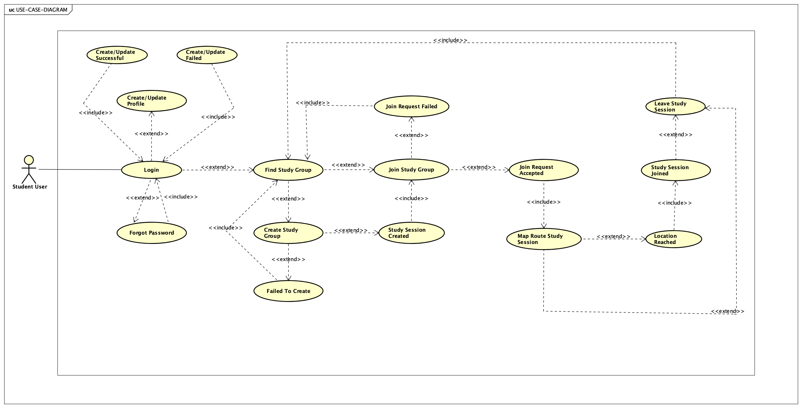

# StudyBuddy - In Progress !!!
The Study Buddy Locator app is poised to revolutionize how students connect and collaborate. By offering a platform for students to find and join study groups, it taps into the power of collaborative learning.

Study Buddy Locator: An Innovative Learning Companion
The Study Buddy Locator app is poised to revolutionize how students connect and collaborate. It taps into the power of collaborative learning by offering a platform for students to find and join study groups.

Persistent Data Storage (Requirement b): The app will leverage either CoreData or Firebase to save and manage data. This ensures that all essential information such as user profiles, study sessions they've initiated or joined, and chat messages remain intact even after the app is closed or updated. This persistent data storage mechanism will serve as the backbone of the app, enabling seamless user experiences and ensuring data integrity.

MVVM Architecture (Requirement c): Utilizing the MVVM (Model-View-ViewModel) design pattern, the app is structured to separate its core components, thus promoting modularity and maintainability. The 'Model' will comprise data entities like user profiles, study session details, and chat messages. The 'View' will be responsible for displaying this data, showcasing user profiles, and available study sessions in a list (TableView) and on a map. The 'ViewModel' will house the business logic, such as matching users based on study subjects or managing join requests.
Remote Web Services (Requirement d): A backend API will manage functionalities like user profiles, study sessions, and chat mechanisms. This ensures that the app can efficiently handle multiple users, storing data remotely and making it accessible from different devices.

Map and Location-Based Functionality (Requirement e): The app will incorporate a map feature to visualize active study sessions. This aids users in identifying study groups nearby, making it convenient to locate and join in-person study sessions.

TableView (Requirement f): To provide a structured view of available study sessions, a TableView will be used. This offers users an organized list, making it easy to browse through and select sessions they're interested in.

In essence, the Study Buddy Locator app is a comprehensive solution, that addresses the critical need for students to find study partners. It encapsulates core concepts, integrating persistent data storage, MVVM architecture, web services, and location-based functionalities, culminating in a holistic learning tool.
Thank you for reading the proposal. Please contact me at sjain166@asu.edu for any further questions or concerns.

Regards, 
Siddharth Jain

# Use Case Diagram

# UML Diagram 

# MVVM Architecture

